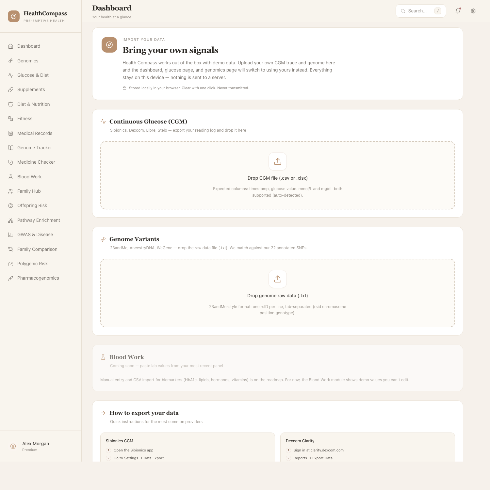

# Health Compass

**Find your bearings before the symptoms speak.**

Health Compass is a pre-emptive personal-health platform. It brings every signal you already produce — your genome, continuous glucose, blood work, daily food, fitness, family history — into one calm, beautiful interface that runs on your own computer. It reads them like an attentive physician would: looking for the early signs, citing the specific source, recommending only what's grounded in your biology.

The bet is simple. Every wearable, every lab, every report you collect *is already saying something specific about your body*. They just don't talk to each other. Health Compass is the place where they finally do.

> Demo build. The shipped data is fictional (the "Alex Morgan" family). rsIDs, lab values, and medical records are placeholders. Not for clinical use. **Upload your own data via the Import page** to see your real numbers in this UI — see the step-by-step guide below.

---

## How it looks


*Dashboard — health score, KPI tiles, weekly trends, wellness radar.*


*Glucose &amp; Diet — every meal correlated with your continuous glucose trace, calorie scan, time-in-range, and a 7-day TIR view.*


*Genomics — chromosome map of annotated variants, with risk levels and pathway groupings.*


*Family Hub — every member's risk profile in one place.*


*Offspring Risk — Punnett-square inheritance projections from parent genotypes.*


*Blood Work — biomarkers grouped by category, with trend sparklines.*


*Import — upload your CGM, genome, and (soon) blood work. Stored locally in your browser, never transmitted.*

---

## What's inside

| Module | What it shows you |
|---|---|
| Dashboard | Daily health score, KPI tiles, weekly trends, wellness radar |
| Genomics | Annotated SNPs across pathways, with risk and supplement guidance |
| Glucose &amp; Diet | 24-hour CGM trace, meal-glucose correlation, calorie scan, food database |
| Supplements | Personal protocol with conflict and synergy detection |
| Diet &amp; Nutrition | Meals, macro rings, weekly calorie trend |
| Fitness | Workouts and exercise demos |
| Medical Records | Lab and visit history with abnormal flags |
| Genome Tracker | Variant table with publication links |
| Medicine Checker | Drug-gene interaction lookup |
| Blood Work | Biomarkers grouped by category, with sparklines |
| Family Hub | Multi-member health overview |
| Offspring Risk | Punnett-square inheritance projections |
| Pathway Enrichment | Genomic pathway enrichment view |
| GWAS &amp; Disease | Genome-wide association references |
| Family Comparison | Self vs partner side-by-side genotype view |
| Polygenic Risk | PRS distribution plots |
| Pharmacogenomics | Drug-metabolism profile |
| **Import Data** | **Upload your own CGM and genome — replaces the demo data with yours, locally** |

---

## Quick start

```bash
git clone https://github.com/Drjackxiaoyuchen/HealthPilot-Demo.git
cd HealthPilot-Demo
npm install
npm run dev
```

Open http://localhost:3000.

That's it. No accounts, no cloud, no tracking. Your data lives in your local clone.

---

## Use your own data — step by step

Health Compass starts with demo data so you can see the interface immediately. To turn it into *your* dashboard, click **Import Data** in the sidebar (or open `/import`) and follow these:

### 1. Continuous Glucose Monitor (CGM)

Health Compass reads CSV and Excel exports from any major CGM provider — readings are auto-detected as mmol/L or mg/dL.

**Sibionics**
1. Open the Sibionics app on your phone.
2. Settings → Data Export.
3. Pick a date range (last 14 days is a good first import).
4. Tap Export → save as `.xlsx` and AirDrop / email to your computer.
5. On the Import page, drop the file. Done.

**Dexcom Clarity**
1. Sign in at https://clarity.dexcom.com.
2. Reports → Export Data → CSV.
3. Pick the date range, download.
4. Drop the CSV on the Import page.

**Abbott FreeStyle Libre / LibreView**
1. Sign in to your LibreView account.
2. Glucose History → Download data → Generic CSV.
3. Drop on the Import page.

**Stelo, Lingo, other CGMs** — any CSV with `timestamp, glucose value` columns will work.

### 2. Genome (23andMe / AncestryDNA / WeGene)

Health Compass matches your raw genome against 22 well-studied SNPs (FTO, MTHFR, COMT, BDNF, APOE, IL-6, VDR, MTNR1B, NQO1, OPRM1, HFE, SOD2, GSTP1, CYP2C19, CYP1A2, PPARG, TCF7L2, plus a few more) and shows you which alleles you carry.

**23andMe**
1. Sign in to 23andMe.
2. Account Settings → Browse Raw Data → Download.
3. Click the link in the confirmation email; download the `.zip`.
4. Unzip — it contains a `.txt` file (~13 MB).
5. Drop the `.txt` on the Import page.

**AncestryDNA / WeGene** — same flow. Download the raw data file, unzip if needed, drop the `.txt`.

### 3. What happens after upload

- The Glucose page banner switches from "Showing demo data" to "Using your uploaded CGM data" and the 24-hour chart redraws from your last full day of readings.
- The Genomics module surfaces the SNPs that matched yours.
- Stats (Time-in-Range, GMI, average glucose, etc.) recompute from your numbers.
- Everything is stored in your browser's localStorage. To wipe it: visit `/import` and click **Clear** on each section, or open DevTools → Application → Local Storage → delete the keys starting with `hp:`.

### 4. Privacy

- Your data never leaves your computer. Upload happens entirely in the browser.
- There is no account, no server, no analytics.
- The repository's `.gitignore` excludes `.env*` and any `data/` you might add — but please don't commit your raw genome to a public repo.

---

## Where it's going

The roadmap is about bringing every digital health tool you already own into one place — and making it easy enough that you don't need to be a developer.

- **Plug in your devices.** One-click connectors for Apple Health, Google Fit, Oura, Whoop, Sibionics CGM, Dexcom, Garmin, Fitbit, and home blood-test reports.
- **One-click local install.** A simple installer for Mac and Windows so anyone can run Health Compass on their own laptop in five minutes, without a terminal.
- **Privacy by default.** Your data never leaves your computer unless you choose to share it. No accounts, no servers, no analytics.
- **Snap a meal, see the impact.** A real food camera that tells you calories, macros, and predicted glucose response before you eat.
- **Family-aware.** Invite the people you care about, see inherited risk together, plan as a household.
- **Mobile companion.** A clean phone view for logging meals, checking glucose, and scanning foods on the go — pairs with the desktop dashboard.
- **Insights that explain themselves.** Every suggestion will cite the SNP, the lab value, or the meal pattern it came from — so you understand *why*, not just *what*.
- **Real research, freshly applied.** Built-in feed of new genetic findings that re-evaluate your variants as the science evolves.

---

## Anonymized demo data

This repository contains only fictional demo data. Before sharing, every identifying signal was anonymized:

- All names → the fictional Morgan family (Alex, Sarah, Robert, Linda).
- All real rsIDs in the bundled seed data → placeholder rs90000xxx identifiers. The Import page recognises real-world rsIDs (rs1801133, rs9939609, etc.) when matching uploads.
- A handful of genotypes were shifted so the demo profile matches no real individual.
- Real facility, lab, and city names → generic placeholders.

If you fork this and add your own data, *keep it local* — the `.gitignore` already excludes `.env*`.

---

## License

Demo / educational use only. No warranty. Not for clinical decisions.
