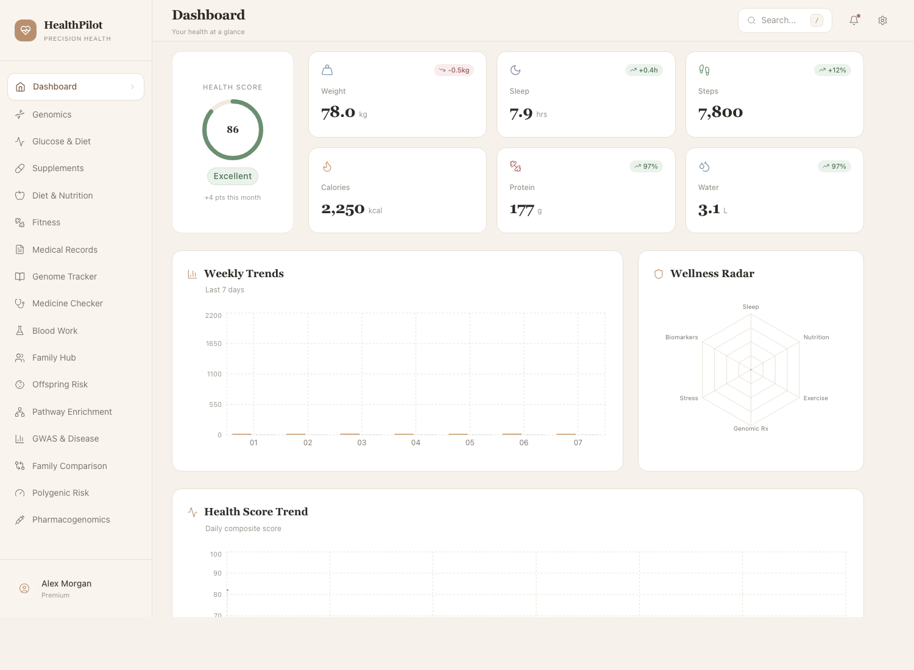
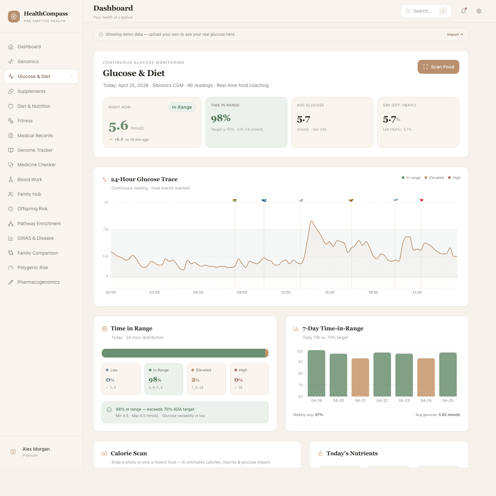
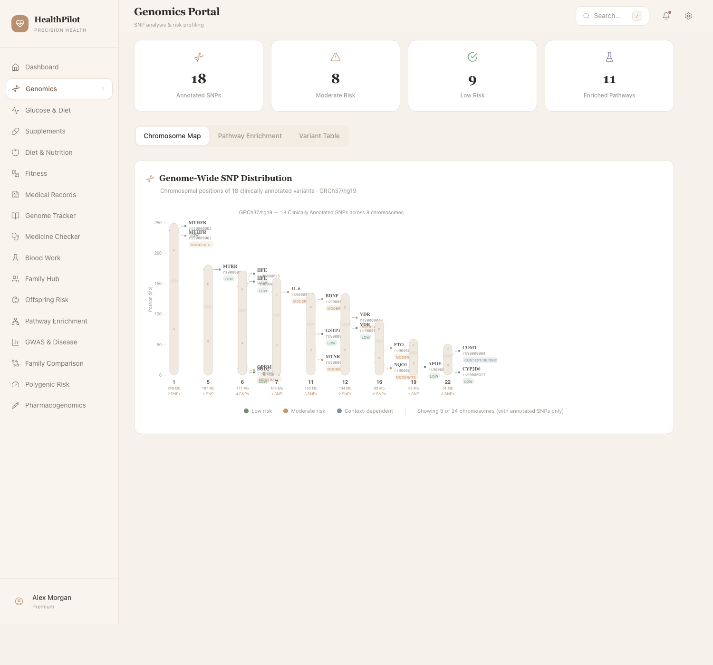
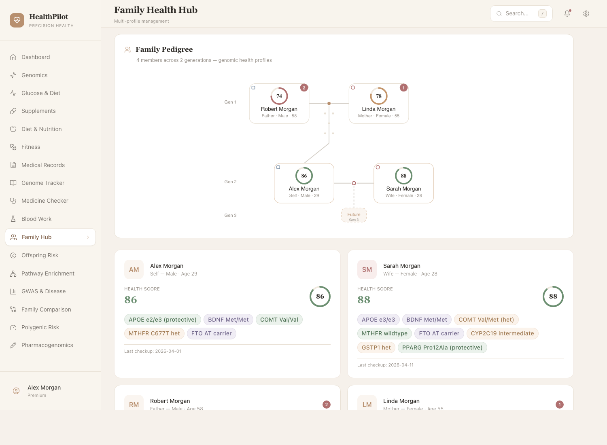
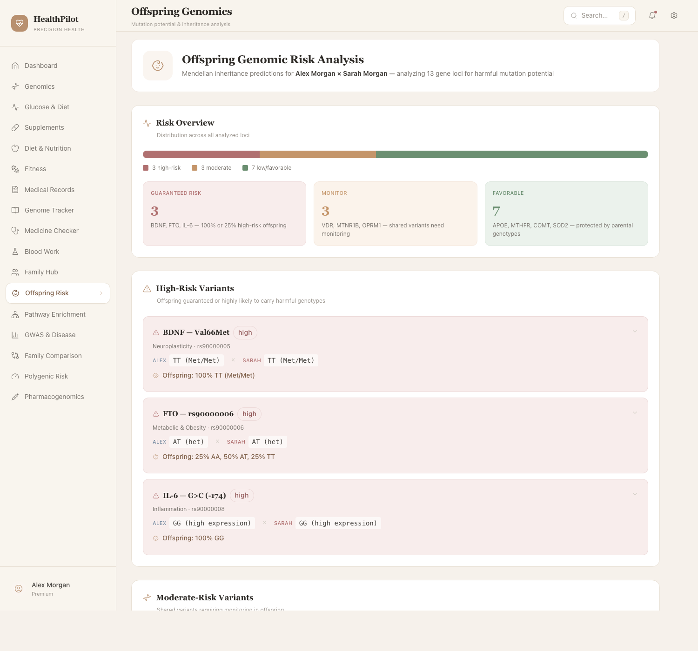
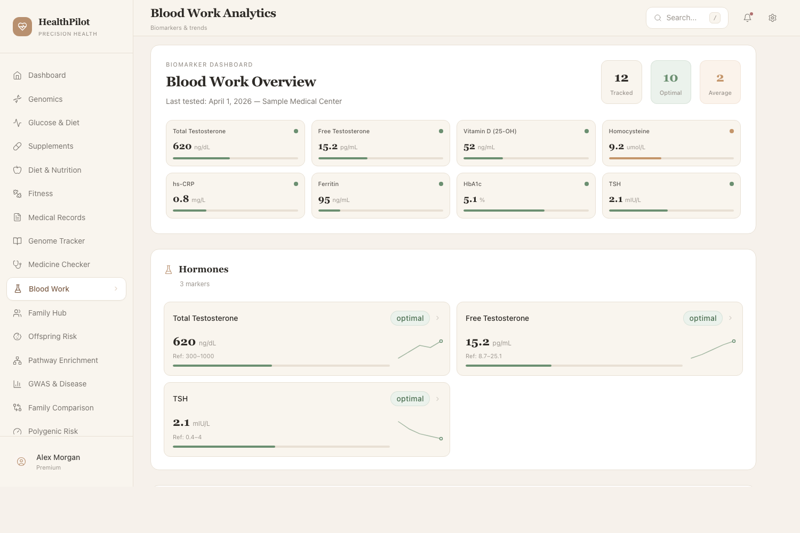

# HealthPilot

**Take control of your own health.** HealthPilot brings every signal you already produce — genome, continuous glucose, blood work, daily food, fitness, family history — into one calm, beautiful interface that runs on your own computer.

The bet is simple: every wearable, every lab, every report you collect *is already saying something specific about your body*. They just don't talk to each other. HealthPilot is the place where they finally do.

> Demo build. All data here is fictional (the "Alex Morgan" family). rsIDs, lab values, and medical records are placeholders. Not for clinical use.

---

## How it looks


*Dashboard — health score, KPIs, weekly trends, wellness radar.*


*Glucose &amp; Diet — every meal correlated with your continuous glucose trace, with a calorie-scan camera and a 7-day time-in-range view.*


*Genomics — chromosome map of your annotated variants, with risk levels and pathway groupings.*


*Family Hub — every member's risk profile in one place.*


*Offspring Risk — Punnett-square inheritance projections from parent genotypes.*


*Blood Work — biomarkers grouped by category, with trend sparklines.*

---

## Why this exists

Most consumer health tools tell you a number on a chart, or generic advice. None of them stitch together your **genome**, your **continuous glucose**, your **blood work**, your **diet**, and your **family history** — all in one place, with every recommendation grounded in the specific signal it came from.

HealthPilot's idea: **you are the integration point**. Your data lives together. Your insights cite their source. Your recommendations are personal because they're tied to *your* SNPs, *your* CGM trace, *your* labs.

The goal isn't more data. The goal is the full picture, calmly arranged, on your own computer, so you can finally take control of your own health.

---

## What's inside

| Module | What it shows you |
|---|---|
| Dashboard | Daily health score, KPI tiles, weekly trends, wellness radar |
| Genomics | Annotated SNPs across pathways, with risk and supplement guidance |
| Glucose &amp; Diet | 24-hour CGM trace, meal-glucose correlation, calorie scan, food database |
| Supplements | Personal protocol with conflict and synergy detection |
| Diet &amp; Nutrition | Meals, macro rings, weekly calorie trend |
| Fitness | Workouts and exercise demos |
| Medical Records | Lab and visit history with abnormal flags |
| Genome Tracker | Variant table with publication links |
| Medicine Checker | Drug-gene interaction lookup |
| Blood Work | Biomarkers grouped by category, with sparklines |
| Family Hub | Multi-member health overview |
| Offspring Risk | Punnett-square inheritance projections |
| Pathway Enrichment | Genomic pathway enrichment view |
| GWAS &amp; Disease | Genome-wide association references |
| Family Comparison | Self vs partner side-by-side genotype view |
| Polygenic Risk | PRS distribution plots |
| Pharmacogenomics | Drug-metabolism profile |

---

## Quick start

```bash
git clone https://github.com/Drjackxiaoyuchen/HealthPilot-Demo.git
cd HealthPilot-Demo
npm install
npm run dev
```

Open http://localhost:3000.

That's it. No accounts, no cloud, no tracking. The data lives in your local clone.

---

## Where it's going

The roadmap is about **bringing every digital health tool you already own into one place** — and making it easy enough that you don't need to be a developer.

- **Plug in your devices.** One-click connectors for Apple Health, Google Fit, Oura, Whoop, Sibionics CGM, Dexcom, Garmin, Fitbit, and home blood-test reports.
- **One-click local install.** A simple installer for Mac and Windows so anyone can run HealthPilot on their own laptop in five minutes, without a terminal.
- **Privacy by default.** Your data never leaves your computer unless you choose to share it. No accounts, no servers, no analytics.
- **Snap a meal, see the impact.** A real food camera that tells you calories, macros, and predicted glucose response before you eat.
- **Family-aware.** Invite the people you care about, see inherited risk together, plan as a household.
- **Mobile companion.** A clean phone view for logging meals, checking glucose, and scanning foods on the go — pairs with the desktop dashboard.
- **Insights that explain themselves.** Every suggestion will cite the SNP, the lab value, or the meal pattern it came from — so you understand *why*, not just *what*.
- **Real research, freshly applied.** Built-in feed of new genetic findings that re-evaluate your variants as the science evolves.

---

## Anonymized demo data

This repository contains only fictional demo data. Before sharing, every identifying signal was anonymized:

- All names → the fictional Morgan family (Alex, Sarah, Robert, Linda).
- All real rsIDs → placeholder rs90000xxx identifiers.
- A handful of genotypes were shifted so the demo profile matches no real individual.
- Real facility, lab, and city names → generic placeholders ("Sample Medical Center", "DemoGene").

If you fork this and add your own data, *keep it local* — the `.gitignore` already excludes `.env*` and your data files should never be committed.

---

## License

Demo / educational use only. No warranty. Not for clinical decisions.
