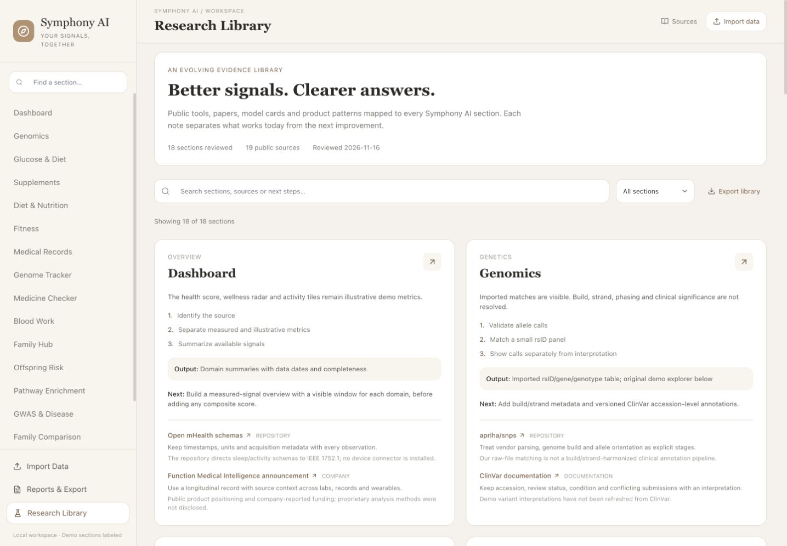

# Symphony AI

**Your health signals, together.**

Symphony AI is a local personal health workspace for glucose, laboratory results, genomic calls, nutrition, activity and family context. It combines an exploratory demo with reviewed imports and source-linked methods. The repository URL retains its original `HealthPilot-Demo` name for link compatibility.

Personal measurements and illustrative results have distinct labels. Most sections remain demonstrations; their scores, risk estimates and recommendations are not validated personal results.



## Run locally

```bash
git clone https://github.com/Drjackxiaoyuchen/HealthPilot-Demo.git
cd HealthPilot-Demo
npm ci
npm run dev
```

Open [localhost:3000](http://localhost:3000). Node.js 20 or newer is recommended. Files are parsed in the browser; no account or external AI service is required.

## What works with your data

| Section | Current behavior |
| --- | --- |
| Import Data | Preview CGM, raw genotype and laboratory files; review notes before replacing the saved dataset |
| Glucose & Diet | Date-selectable trace, observed-duration range statistics, elapsed-window coverage, CV, daily summaries and exploratory hourly percentile bands |
| Blood Work | CSV import, searchable marker/unit/lab series, source reference intervals and dated histories |
| Genomics | Display uploaded calls that match a small 22-record rsID panel; keep the original demo explorer visibly separate |
| Reports & Export | Personal JSON report, normalized CGM/lab/matched-call CSVs, hourly profile CSV and printable summary |
| Research Library | Searchable methods, public references and next improvements for all 18 original sections |
| Other sections | Labeled, fixed illustrative data; personal uploads do not generate their scores, recommendations or family profiles |

The interface, metadata and exported reports use **Symphony AI**. The sidebar includes section search and mobile navigation.

## Import formats

Use **Import Data** in the sidebar. Choose a file, inspect the preview and quality notes, then select **Save reviewed data**. Replacements affect only the corresponding dataset type. Example CSV downloads are available in the app and in [docs/examples](docs/examples).

### Continuous glucose

CSV / TSV / semicolon-delimited files, or the first worksheet of an Excel workbook:

```csv
timestamp,glucose_mmol_l
2026-11-15T08:00:00+08:00,5.2
2026-11-15T08:05:00+08:00,5.4
```

Use an unambiguous `YYYY-MM-DD HH:mm` or ISO 8601 timestamp. Offset-free timestamps use the device time zone. Explicit offsets identify instants, which are displayed in the device time zone. Ambiguous dates such as `04/05/2026` require normalization before import.

`glucose_mg_dl` is also supported. A generic `glucose` / `value` column needs an explicit unit selection. Units are never inferred from the values. Timestamp and glucose columns can be reordered; recognized timestamp names include `timestamp`, `datetime` and `device timestamp`. Provider-specific exports may need column/date cleanup. Glucose values outside 1–40 mmol/L or equivalent and invalid rows are excluded with a count. Duplicate timestamps keep the last row. Excel parsing is bundled locally, with no runtime CDN script.

Statistics use all valid imported readings. Each reading is held for at most one inferred sensor interval, leaving longer gaps missing. Coverage is observed duration divided by the elapsed upload window, including one final interval. The interval is the median positive gap of at most 20 minutes, or a 5-minute fallback when unavailable. This estimate cannot distinguish every missing-sampling pattern from a sensor's true cadence. CV uses duration-weighted population SD divided by the mean.

The default reporting range is 3.9–10.0 mmol/L, following a common diabetes convention, without assigning a universal personal target. GMI is withheld until at least 14 elapsed days and 70% estimated coverage. It is a CGM-derived estimate, not a laboratory HbA1c. Hourly bands are unweighted sample percentiles without interpolation; they are exploratory and are not validated as an equivalent to a clinical AGP report. Personal traces do not include demo meal overlays or inferred food/genome advice.

### Laboratory results

```csv
marker,value,unit,collected_at,reference_low,reference_high,category,lab,loinc
HbA1c,5.4,%,2026-10-15,4,5.6,Metabolic,Example Lab,4548-4
HbA1c,5.2,%,2026-11-15,4,5.6,Metabolic,Example Lab,4548-4
```

Required: `marker`, `value`, `unit`, `collected_at` (YYYY-MM-DD). Other columns are optional. Numeric zero is retained. Missing reference limits remain missing; one-sided intervals are supported. Invalid rows block saving until corrected. Duplicate marker/unit/date/lab rows keep the last row and are disclosed in the preview.

Marker names, units, laboratory names and intervals come from the file. Trend series use the marker name (case-insensitive), **exact unit and laboratory**. No automatic analyte harmonization or unit conversion is applied. A reference-range flag is descriptive, not a diagnosis or overall-health score. PDF/image extraction remains future work.

### Genome calls

Unzipped 23andMe-style text (`rsid chromosome position genotype`) or AncestryDNA-style text with two allele columns. Only A/C/G/T calls are retained; no-calls are excluded. Only matches to the 22-record panel are saved, rather than the entire raw genome.

This is rsID matching, without build/strand harmonization, phasing or clinical interpretation. It does not calculate PRS, pharmacogene diplotypes, supplement needs or offspring disease risk. Imported calls are shown above the separate demo genomics explorer.

## Research-informed development

The [Research Library](http://localhost:3000/research) maps 19 public references to all 18 original sections. [Development notes](docs/research-informed-development.md) record the adopted patterns, remaining work and evidence boundaries. References include Nightscout, iglu, Open mHealth, Open Food Facts, wger, Medplum, ClinVar, GWAS Catalog, PGS Catalog Calculator, PharmCAT, CPIC, a Hugging Face MedGemma model card and Function's public product announcement.

Sources inform design and method choices; their code, models, databases and proprietary algorithms are not installed or reproduced. Links open source websites without attaching uploaded datasets. References were reviewed on **2026-11-16**; there is no automatic literature refresh or background research job.

## Storage and exports

Uploads are processed locally and stored in unencrypted browser `localStorage`. Existing `hp:*:v1` keys are retained for compatibility after the rename. Same-origin scripts and people using the browser profile can access the data. The app bundles its Excel reader and uses system fonts; it does not load an external AI model or send uploaded files to an analysis API.

Browser storage is not a backup and may be cleared. Keep original files. Clear individual datasets on Import Data. Reports explicitly export personal data when requested; demo values are omitted from the personal JSON report. Reports include source filename, upload time, normalization units, methods, quality notes and references.

Do not commit personal data. `.gitignore` excludes `data/`, `imports/`, `exports/`, private environment files and local test artifacts. Files elsewhere still need review before committing.

## Checks

```bash
npm test
npm run typecheck
npm run build
```

Tests cover parsing, declared units, invalid dates, missing data, time weighting, range boundaries, GMI availability, local-day grouping, lab reference intervals, unit/lab separation, genome no-calls, CSV exports and demo/personal report boundaries. CI runs these checks against a clean install.

## Use and limitations

The demo includes a fictional Morgan family and illustrative genetic, clinical and lifestyle interpretations. These examples have not been validated for clinical decisions. Imported measurements are useful for personal organization and exploration; the application does not diagnose conditions or recommend medication changes.

Demo / educational use only. No warranty. The `symphony-*.jpg` screenshots show the refreshed interface with synthetic examples. Other screenshots in `docs/screenshots` predate the refresh and are historical references.
